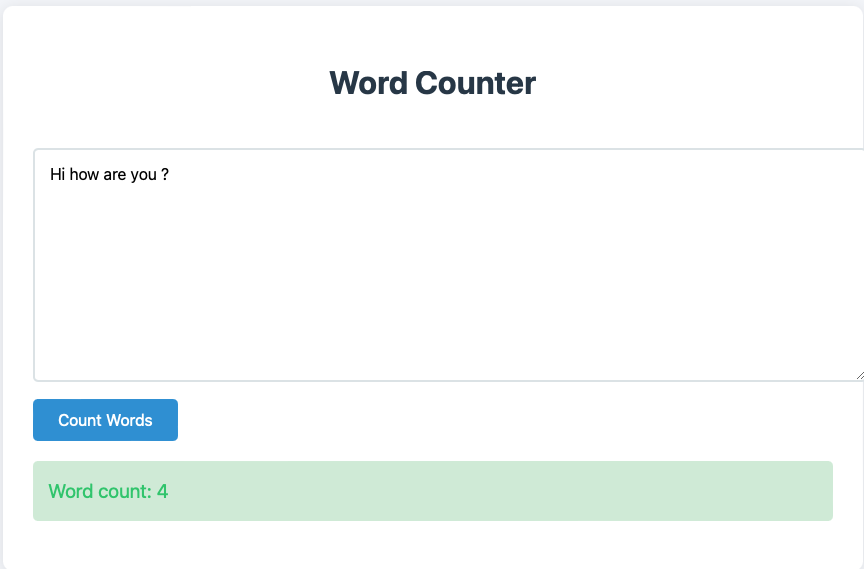

# word-count
A web application that count words in the text input

## Assumptions
1. I am not considering single numbers as words;
2. I don't count ponctuation as words;
3. I am not considering emojis as words;
4. If there is at least one valid string in a word I am considering it a valid word, example: great!, hel1o;
5. The maximum length accepted is 10.000 characters;
6. The delimiters identified by the aplication are: ' ', '-', '|';
7. I am requiring when filling the input text box at least 1 char.

## Usage on docker
Build the docker image
```
docker build -f Dockerfile -t wordcount .
```

Run the docker image:
```
 docker compose up -d
```

Visit http://localhost:8000 in your browser

## Tests

To run the tests, run pytest in the word-count directory
```
 pytest -W ignore::DeprecationWarning
```

Our tests cover the following cases:
The count functionality, multiline texts, texts bigger than max size, text with number, text with emojis, text with special characters, text with "-" delimiter and empty words


## Output sample


# Next steps
- Need to develop support for non latin languages such as Japanese and Korean;
- The algorithm can be optimized for better performance in the space and time dimensions;
- The supported delimiters can be expanded 
- Add support on the frontend for word count frequency
- Add logging to the application
- Expand tests to cover more edge cases
- Resolve the deprecated warning
- Add a login to the form